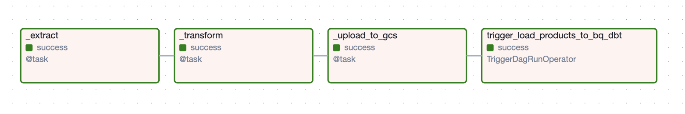
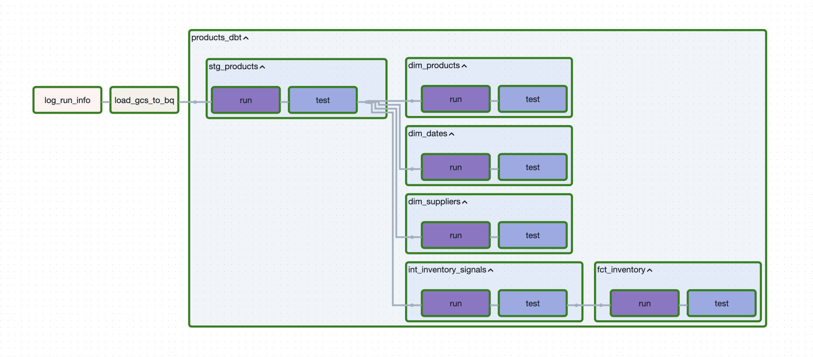
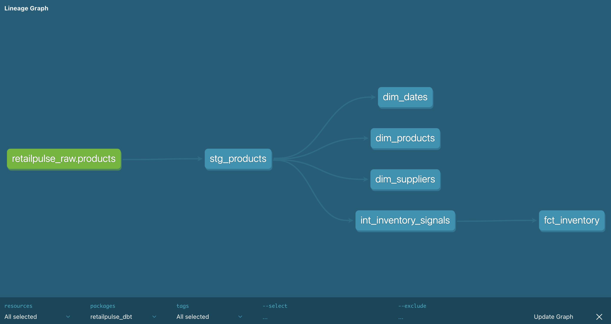

# RetailPulse Analytics — End-to-End ELT Pipeline

Built a production-grade ELT pipeline to ingest, process, and analyze near real-time e-commerce inventory data using **Airflow**, **BigQuery**, and **dbt**.

---

## Key Highlights
- Designed an end-to-end data pipeline: **API → GCS → BigQuery → dbt**  
- Implemented **incremental data processing** for scalable data handling  
- Built **star schema** (fact + dimension modeling) for analytics  
- Developed **inventory risk**, **demand signals**, and **supplier risk metrics**  
- Orchestrated workflows using **Apache Airflow (Astro)**  
- Ensured data quality using **dbt tests** (uniqueness, integrity, null checks)

---

## Architecture
- Airflow → handles ingestion, scheduling, retries, orchestration
- GCS → stores raw extracted data
- BigQuery → data warehouse (raw + transformed layers)
- dbt → transformation layer (staging → intermediate → mart)

---

## Tech Stack
- Python  
- Apache Airflow (Astro)  
- Google BigQuery  
- Google Cloud Storage (GCS)  
- dbt (Data Build Tool)  

---

## Business Goal
Enable near real-time monitoring of:  
- Inventory health  
- Pricing dynamics  
- Supplier efficiency  

to support **operational decision-making** in e-commerce systems.

---

## Key Questions Answered
- Which products are at risk of stock-out?  
- Which suppliers have long lead times?  
- Are product discounts effective?  
- Which products show high demand but low stock?  
- How does inventory vary across regions?  

---

## Data Modeling

### Star Schema Design

---

### Dimension Tables

**dim_product**  
- 1 row per product  
- Columns: `product_id`, `name`, `category`, `brand`  

**dim_supplier**  
- 1 row per supplier  
- Columns: `supplier_name`, `contact`, `lead_time_days`  

**dim_date**  
- 1 row per date  
- Columns: `date_key`, `day`, `month`, `year`  

---

### Fact Table — fct_inventory

**Grain:** 1 row per product per ingestion_time (snapshot-based)  

Includes:  
- **Inventory metrics:** `stock_quantity`, `reorder_point`  
- **Pricing:** `msrp`, `sale_price`, `discount`  
- **Signals:** `alert_flag`, `demand_flag`, `inventory_risk_flag`  
- **Time:** `ingestion_time`, `date_key`  

---

## Data Transformation Layers (dbt)

### Staging (`stg_products`)
- Clean and flatten raw API data  
- Standardize schema  

### Intermediate (`int_inventory_signals`)
- Generate business logic:  
  - Stock alerts  
  - Demand signals  
  - Supplier risk  
  - Days since restock  

### Mart (`fct_inventory` + dimensions)
- Final analytics-ready tables  
- Optimized for reporting and dashboards  

---

## Key Metrics & Signals
- **Low Stock Flag:** inventory below reorder point  
- **High Demand Flag:** high rating + high reviews  
- **Inventory Risk Flag:** combines demand + stock + lead time  
- **Days Since Restock:** freshness of inventory  

---

## Data Quality
Implemented using **dbt tests**:  
- Uniqueness checks (fact grain validation)  
- Referential integrity (fact ↔ dimensions)  
- Not-null constraints  

---

## Screenshots
### Airflow DAG execution  
- product_data_dag

- load_products_to_bq_dbt_dag

### dbt docs lineage  

---

## Key Learnings
- Designing incremental pipelines for large-scale data  
- Implementing star schema modeling for analytics  
- Orchestrating workflows using Airflow + dbt integration  
- Handling real-world API constraints (rate limiting, retries)  